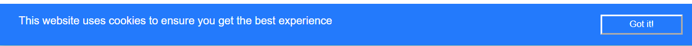

# Cookie Alert Web Component

A simple cookie alert implemented as a Web component.

You can use it by importing the script `cookieAlert.js` in your HTML page as shown in the following:

```html
<!doctype html>
<html>
<head>
	...
	<script src="cookieAlert.js"></script>
</head>
...
```

and using the tag <cookie-alert></cookie-alert>` like a normal HTML tag.

The component should appear at the bottom of your page as shown in the following picture:



